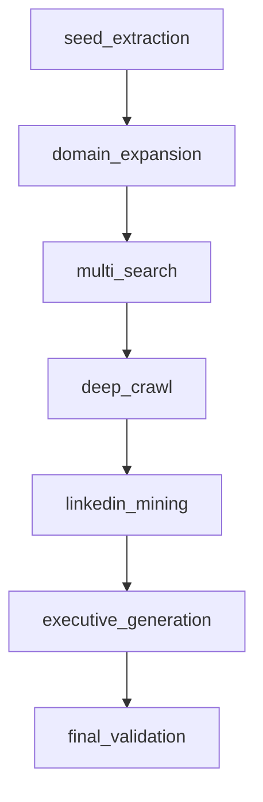

# Enterprise‑grade E‑mail & Executive Contact Extractor

> **1\_advanced\_mail\_extractor\_working.py** – an async, multi‑stage pipeline that hunts down validated business e‑mails (incl. C‑suite guesses) for hundreds of companies.

---

## ✨ Highlights

* **Full‑stack async** – `asyncio`, `aiohttp`, and [LangGraph](https://github.com/langchain-ai/langgraph) keep CPU cores busy and the network saturated.
* **Smart throttling** – per‑host semaphores (`HOST_SEMAPHORE_LIMIT`) + exponential back‑off tame aggressive sites.
* **Triple‑layer validation** – regex → optional [`email‑validator`](https://github.com/JoshData/python-email-validator) → MX lookup (cached).
* **Retrieval mesh** – DuckDuckGo/Bing search → targeted site crawl → LinkedIn scrape → LLM‑assisted domain & exec inference.
* **Auditable confidence** – heuristic scoring, MX boost, scraped vs synthetic flag.
* **Excel deluxe** – styled **Contact\_Intelligence** sheet + summarised **Summary** sheet.
* **Pluggable brains** – swap `OLLAMA_MODEL` via env var (defaults to `llama4:scout`).
* **Zero proprietary libs** – pure‑Python & F/OSS dependencies only.

---

## 📂 Project Layout (minimal)

```text
.
├── 1_advanced_mail_extractor_working.py  # the extractor
├── requirements.txt                      # dependencies
├── sample_companies.xlsx                 # example input (CompanyName column)
└── README.md                             # you’re here
```

---

## 🛠️ Prerequisites

| Requirement | Version  | Notes                                |
| ----------- | -------- | ------------------------------------ |
| **Python**  | 3.10 +   | 3.12 OK, Pypy untested               |
| **pip**     | 23 +     | or `pipx`, `poetry`, etc.            |
| **Ollama**  | 0.1.30 + | running locally or network‑reachable |

> **Tip:** GPU acceleration is optional but highly recommended for the LLM stage.

---

## ⚙️ Environment Variables

| Variable               | Default                  | Purpose                                       |
| ---------------------- | ------------------------ | --------------------------------------------- |
| `OLLAMA_URL`           | `http://localhost:11436` | Base URL to your Ollama server.               |
| `OLLAMA_MODEL`         | `llama4:scout`           | Any chat‑style model you have pulled.         |
| `CONCURRENT_WORKERS`   | `12`                     | Parallel company slots (balance CPU & I/O).   |
| `HTTP_TIMEOUT`         | `20`                     | Seconds per HTTP GET.                         |
| `MAX_RETRIES`          | `3`                      | Per‑URL attempts before give‑up.              |
| `HOST_SEMAPHORE_LIMIT` | `3`                      | Max simultaneous requests per host.           |
| `BACKOFF_FACTOR`       | `1.5`                    | Exponential delay multiplier (if you add it). |

Add these to a `.env` file or export in your shell.

---

## 🔧 Setup

1. **Grab the files** – drop `1_advanced_mail_extractor_working.py` and `requirements.txt` into a fresh folder (no Git needed).
2. **Create a virtual‑env** (recommended):

   ```bash
   python -m venv venv && source venv/bin/activate
   ```
3. **Install dependencies**:

   ```bash
   pip install -r requirements.txt
   ```

   *`email‑validator` and `dnspython` are optional but strongly encouraged.*

---

## 🚀 Quick‑start

1. Place any `.xlsx` or `.csv` with a **CompanyName** column in the directory.
2. Run the extractor:

   ```bash
   python 1_advanced_mail_extractor_working.py
   ```
3. Watch the live feed – symbols decode as:

   * `✅` e‑mail found      \* `❌` none yet   \* `🔒` MX valid   \* `⚠️` MX uncertain

Example snippet:

```text
🚀 Processing 300 companies | workers 12 | model llama4:scout
  1/300 | Acme Corp                | ✅ 🔒 0.82 | ceo@acme.com
  2/300 | Globex                   | ❌ ⚠️ 0.00 | No email found
```

---

## 📤 Outputs

### 1. **Contact\_Intelligence** sheet

| Column               | Description                              |
| -------------------- | ---------------------------------------- |
| `No`                 | Row index                                |
| `Company`            | Original name                            |
| `Primary_Email`      | Highest‑confidence address               |
| `Confidence`         | 0‥1 heuristic score                      |
| `MX_Valid`           | ✓/✗ after DNS MX lookup                  |
| `Alternative_Emails` | Up to 4 additional addresses             |
| `Total_Found`        | Raw unique addresses scraped + synthetic |
| `Domains`            | Top 3 candidate domains                  |
| `Executive_Count`    | Exec guesses with e‑mail variations      |
| `Processing_Time`    | Seconds spent on this company            |

### 2. **Summary** sheet

Aggregates success rate, MX validity %, total scraped vs synthetic, average time per company, etc.

### 3. **Logs**

`extractor.log` – verbose per‑step diagnostics with throttled repeating warnings.

---

## 🧬 Pipeline Overview



**Key stages**

1. **Seed extraction** – pull any e‑mails/domains embedded in the spreadsheet row.
2. **Domain expansion** – LLM suggests likely corporate domains if <3 found.
3. **Multi‑search** – DuckDuckGo & Bing queries capture extra URLs.
4. **Deep crawl** – fetch contact/about/team pages & extract addresses/names.
5. **LinkedIn mining** – duck for public profile snippets; collect any mailto’s.
6. **Executive generation** – LLM proposes exec names; craft realistic address patterns.
7. **Final validation** – score, dedupe, MX‑check & export.

---

## 🔬 Scoring Cheat‑sheet

| Signal                                        | Weight                                 |
| --------------------------------------------- | -------------------------------------- |
| Domain exact match                            | +0.4                                   |
| Company token in domain                       | +0.3                                   |
| Friendly local part (`info`, `contact`, etc.) | +0.2                                   |
| MX record present                             | +0.2 (additional boost at final stage) |
| Long/bizarre local part                       | −0.1                                   |

Scores cap at **1.0**; MX validity is surfaced separately.

---

## 🩹 Troubleshooting

| Symptom              | Cause               | Fix                                                 |
| -------------------- | ------------------- | --------------------------------------------------- |
| All requests timeout | Proxy / firewall    | Set `HTTP_PROXY`, increase `HTTP_TIMEOUT`.          |
| Many `HTTP 429`      | Rate‑limited site   | Lower `CONCURRENT_WORKERS`, raise `BACKOFF_FACTOR`. |
| Low success rate     | Over‑strict filters | Inspect `BAD_FRAGMENTS`; relax cautiously.          |
| MX checks slow       | DNS blocked         | Install `dnspython`, ensure outbound UDP 53.        |
| Ollama errors        | Model not pulled    | `ollama pull llama4:scout` then retry.              |

---

## 🗺️ Extending

* **Add search engine** – append template to `SEARCH_ENGINES` list.
* **Swap LLM** – wrap `ask_llm()` for OpenAI, Anthropic, etc.
* **Persist elsewhere** – replace Excel writer with DB insert or API call.
* **Tune heuristics** – tweak `score_email()` or inject your own ML model.

---

## 📦 Dependencies (core)

```text
aiohttp
beautifulsoup4
langchain
langgraph
langchain‑ollama
pandas
xlsxwriter
python‑dotenv
email‑validator  # optional
dnspython        # optional
```

---

## 📑 License

MIT – see `LICENSE`.
